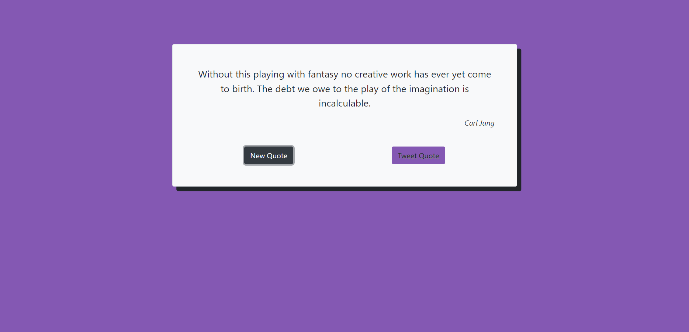
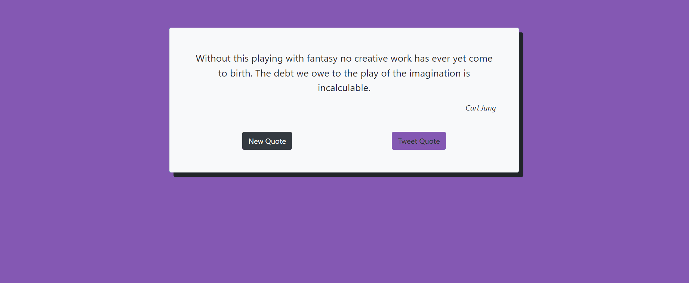

# Bootstrap Random-Quote Generator

### This is a Random Quote Generator project for the Front End libraries Certification of Freecodecamp

On this simple project I learned about async functions and how to get data from an API and display it on the document object. The quote API used is [Quote API](https://type.fit/api/quotes). More than that, the simple layout was quickly and easily made using [Bootstrap 5](https://getbootstrap.com).

### The API:
 Type.fit quotes API

 This API returns a JSON with a text and a author (if have one) and the javascript display it through a function to the document that trigger on a button.

 ### The Design:
  The design was made using Bootstrap, a simple container parenting the texts and buttons. Inludes a custom box shadow and a JS function to change the background color for each quote generated when the button is clicked.
   
   